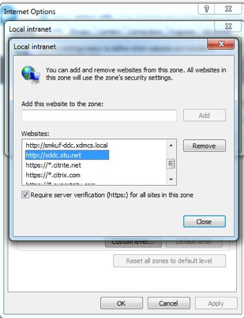
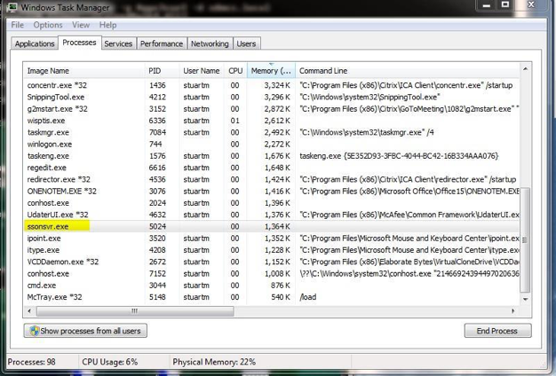

#Setting up your environment

To use the Fast Connect API you must first configure your site
appropriately, including setting up SSO:

 1. If you are using StoreFront, enable the HTTP Basic authentication method as follows:

 2. Install Citrix Receiver for Windows 4.2 or later using the `/includesson` flag: `CitrixReceiver.exe/includesson`
 3. By default, user credentials are captured at Windows session logon. This may not always be desirable, especially in off-domain pass-through scenarios; to disable logon credential capture, use the `LOGON\_CREDENTIAL\_CAPTURE\_ENABLE` setting:

        CitrixReceiver.exe/includesson
		LOGON\_CREDENTIAL\_CAPTURE\_ENABLE=No
    
 4. Import the `receiver.adml` and `receiver.admx` files and then open `gpedit.msc`. This will make the Group Policy templates appear within the gpedit.msc
GUI.   

!!!tip "Note"
	    * For information on importing Citrix Receiver for Windows Group Policy administrative template for Citrix Receiver for Windows Version 4.5, see [Citrix Product Documentation.](http://docs.citrix.com/en-us/receiver/windows/4-5/configure/ica-import-icaclient-template-v2.html)
		* For information on importing Citrix Receiver for Windows Group Policy administrative template for Citrix Receiver for Windows Version 4.6, see [Citrix Product Documentation.](http://docs.citrix.com/en-us/receiver/windows/4-6/configure/ica-import-icaclient-template-v2.html)
				
&#53;. Navigate to the administrative templates folder and then select **Citrix Components** > **Citrix Receiver** > **User authentication**.

&#54;. Select the GPO policy Kerberos authentication, double-click it, and then disable it.

!!! tip "Note"
		 The order in which you configure policies is important. You must disable Kerberos authentication before configuring the Local user name and password policy as described in step 6. 

&#55;. To allow SSO functionality, locate the GPO policy Local user name and password, double-click it, and then enable the following options:

  * Enable pass-through authentication
  * Allow pass-through authentication for all ICA connections

&#56;. Navigate to the administrative templates folder and then select **Citrix Components** > **Citrix Receiver** > **Fast Connect API Support**

&#57;. To allow Fast Connect functionality, locate the GPO policy Manage FastConnectAPI support, double-click it, and then enable the following options:

  * Enable the GPO
  * Enable Fast Connect API Functionality 
  * Disable Leave Apps Running On Logoff
  * Enable Integrate Self Service Plugin with FastConnect

&#49;&#48;. Optionally, in the administrative templates folder, select **Citrix Components** > **Citrix Receiver** > **SelfService** > **Manage App shortcut**:

  * Startmenu Directory = Citrix
  * Desktop Directory = Citrix
  * Disable Startmenu Shortcut = False (clear checkbox)
  * Enable Desktop Shortcut = True (select checkbox )
  * Disable Categorypath = True (select checkbox to use StoreFront categories in the Start menu)
  * RemoveAppsOnLogoff = True (select checkbox)
  * Clear the set of applications shown in the Receiver Windows on log off = True (select checkbox)
  * Prevent Receiver performing a refresh of the application list when opened = True (select checkbox)
  * Ignore self service selection of apps and make all mandatory = False (clear checkbox), but True (select checkbox) if you are using Web Interface

&#49;&#49;. Optionally, select **SelfService** > **Control when Receiver attempts to reconnect to existing sessions**: 

  * Enable the policy
  * Choose the appropriate combination of reconnect conditions

&#49;&#50; Optionally, select **SelfService** > **Enable application Prelaunch**. Enable this policy to disable prelaunch.

&#49;&#51;. If you are using StoreFront, add the FQDN of the XenDesktop Controller to the intranet zone: 
You can set this through Group Policy:

* Select **Computer Configuration** > **Administrative Templates** > **Windows Components** > **Internet Explorer** > **Internet Control Panel** > **Security Page**
* Select **Site to Zone Assignment List**, enable it, then add the FQDN of the XenDesktop Controller as a zone assignment with a value of **1**. For more details, see
[http://blogs.msdn.com/b/askie/archive/2012/06/05/how-to-configure-internet-explorer- security-zone-sites-using-group-polices.aspx]()

&#49;&#52;. On the command line, rungpupdate/forceto apply these settings.

&#49;&#53; Start Citrix Receiver from the Start menu.

&#49;&#54;. When you are prompted for an account, specify the URL for your StoreFront Services Site, StoreFront XenApp Services Site, or Web Interface XenApp Services Site. 

A StoreFront URL looks like this: *https://SMBSZ-XENAPPS1.xa.local/Citrix/Store/discovery*

A Web Interface URL looks like this: *https://SMBSZXENAPPS1.xa.local/Citrix/PNAgent/config.xml*

!!! tip "Note"
		If you require an http (unsecure) URL, first perform step 13 above before re-attempting this step.

&#49;&#55;. If you are using a HTTP site, set the following registry key to allow HTTP traffic for Citrix Receiver:

* On 64-bit Windows:

```
HKLM\SOFTWARE\Wow6432Node\Citrix\Authmanager
Name: ConnectionSecurityMode
Type: REG_SZ
Data: Any
```
* On 32-bit Windows:

```
HKLM\SOFTWARE\Citrix\AuthManager
Name: ConnectionSecurityMode
Type: REG_SZ
Data: Any
```
&#49;&#56;. Restart Citrix Receiver.

&#49;&#57;. If you are using StoreFront, create the following registry keys and
values on the endpoint(s) to allow HTTP Basic authentication, which is needed for SSO:

* On 64-bit Windows:

```
HKEY_LOCAL_MACHINE\SOFTWARE\Wow6432Node\Citrix\AuthManager\Protocols
\httpbasic 
Name: Enabled
Type: REG_SZ 
Data: True
```
```
HKEY_LOCAL_MACHINE\SOFTWARE\Wow6432Node\Citrix\AuthManager 
Name: ProtocolOrder
Type: REG_MULTI_SZ
Value: httpbasic
```
* On 32-bit Windows:

```
HKEY_LOCAL_MACHINE\SOFTWARE\Citrix\AuthManager\Protocols\httpbasic 
Name: Enabled
Type: REG_SZ 
Data: True
```
```
HKEY_LOCAL_MACHINE\SOFTWARE\Citrix\AuthManager 
Name: ProtocolOrder
Type: REG_MULTI_SZ
Data: httpbasic
```

&#50;&#48;. To get the store accepted, log on as any user and restart the endpoint.

&#50;&#49;. When the endpoint restarts, verify that the SSO functionality is enabled by running ssonsvr.exe, as described at [http://support.citrix.com/article/CTX133855](http://support.citrix.com/article/CTX133855)



&#50;&#50;. You can now inject a user name and password into the SSO functionality by interacting with the Fast Connect API, using the LogonSsoUser() function described later in this document.

&#50;&#51;. If you would like the Self-Service Plug-in UI to automatically log on and log off in response to the Fast Connect LogonSSOUser and LogoffSSOUser library calls and thereby update the user’s icons, enable the policy “Integrate Self Service Plugin with FastConnect” described in step 8.

Alternatively, you can manually update the UI and desktop icons following these calls by using the following sequence:

```
SelfService.exe –ipoll 			// Refreshes the SSP GUI
```
&#50;&#52;. Start Receiver from the Start menu. The injected user will be logged on to Receiver.

All the user’s applications then appear for the first time on the desktop, the Start menu, and within the SSP GUI.


&#50;&#53;. To inject further user credentials into Receiver through Fast Connect, repeat Step 15. Receiver on the endpoint is now set up for SSO and Fast Connect API use.
